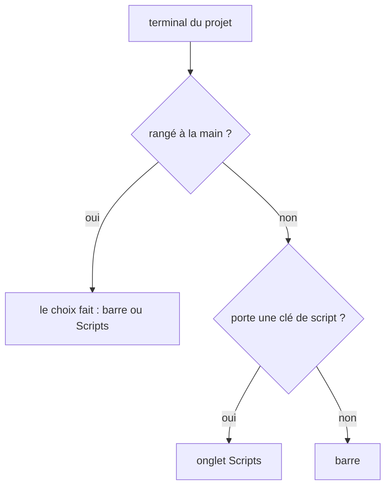
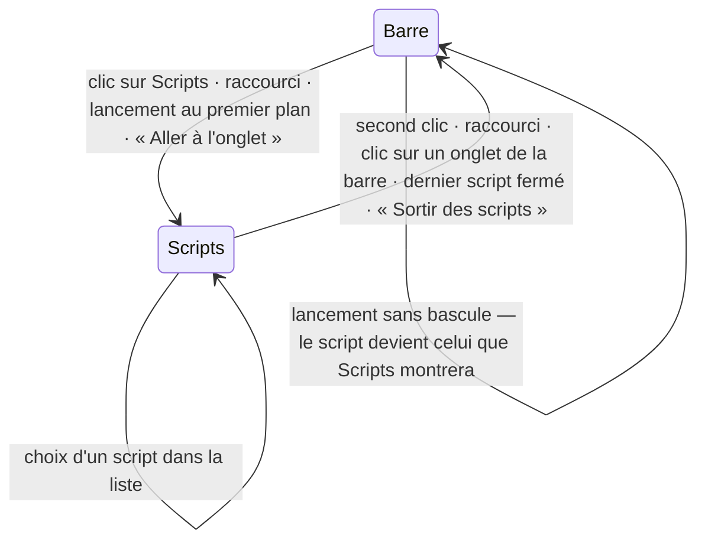

# Conception — les scripts sous un seul onglet

Contrats et structure de la piste 11 de [`pistes.md`](pistes.md). Ce document fixe
les formes (types, état gardé, règles, découpage) ; le code viendra MR par MR, dans
l'ordre de la dernière section.

Contraintes de départ, inchangées :

- `core/` reste pur : ni Electron, ni Windows, ni PTY.
- Le serveur est la seule autorité sur les processus ; le client ne parle qu'au
  WebSocket et à l'API HTTP, derrière le jeton.
- Les instances xterm vivent hors de React et ne sont jamais recréées au rendu.

Le serveur ne change pas : tout se joue dans le client.

---

## 1. Le constat

Un onglet de script est un shell qui porte sa clé `dossier|nom` (`info.script`),
gardée par le serveur. Tout ce qui lance passe par `runScript` : la vue Scripts et
ses groupes, `installer`, le ▷ de la marge, les suites de tests en arrière-plan.
Chaque onglet ainsi ouvert prend place dans la barre, entre les onglets Claude, les
shells et les fichiers, rangé par `tabOrder`.

Ce qui manque pour la piste :

1. **Rien ne distingue un script dans la barre** : il n'a qu'un point de couleur,
   comme un shell.
2. **L'onglet ne connaît pas sa commande.** `runScript` la reçoit de son appelant,
   la tape, et l'oublie. Une ligne de la liste ou la barre flottante ne pourrait
   donc rien relancer. La dernière ligne tapée dans le shell ne convient pas : après
   une session Claude, ce serait `claude`.
3. **Plusieurs gestes visent « l'onglet actif »** sans dire s'il s'agit de ce qu'on
   regarde ou de la session qu'on suit : le bloc du bas, le pied de la zone,
   `sendToClaude`, « Fermer les autres onglets ».

---

## 2. Le principe : une règle de placement, pas un mode

Aucun drapeau « vue Scripts ouverte » n'est ajouté. Chaque terminal a un
**placement**, `bar` ou `scripts`, calculé par une règle ; la zone centrale montre
l'onglet Scripts **si et seulement si le terminal actif est placé dans `scripts`
et qu'aucun fichier n'est montré**.

Conséquences, qui sont la raison du choix :

- `focusTerminal(id)` suffit pour montrer un script, d'où qu'il vienne : « Aller à
  l'onglet », la marge, le panneau des processus, une notification. Aucun appelant
  n'a à savoir que les scripts sont ailleurs.
- On ne peut pas être sur l'onglet Scripts sans script choisi : l'état impossible
  n'existe pas.
- Changer de projet et revenir, ou recharger la page, rend la vue où on l'avait
  laissée : `activeTab` retient déjà le dernier terminal regardé.



La règle ne regarde pas `kind` : un terminal de l'onglet Scripts où Claude démarre —
un shell rangé à la main, ou un script qui lance lui-même `claude` — y reste, et en
repart quand on le décide (§ 4.6). **Aucun terminal ne change de place sans un
geste.** Un script fini, lui, refuse la frappe (§ 4.6 bis) : on ne peut pas y taper
`claude`.

Les hôtes xterm ne changent pas de parent. Ils restent tous dans le même cadre,
comme aujourd'hui ; l'onglet Scripts insère sa liste **à gauche de ce cadre**, qui
rétrécit. Basculer ne fait que changer le terminal visible et la largeur du cadre,
puis réajuste xterm comme à chaque changement d'onglet.

```
┌ ▤ Scripts 2 ┆ ✳ claude │ ● shell │ App.tsx ──────────────────┐ +
│ ┌───────────────────┬┬──────────────────────────────────────┐ │
│ │ ▾ ◎ Serveurs 2    ││ VITE v6  ready in 300 ms       ■ ↻ ⤴ │ │ ← barre flottante
│ │ ● api › dev   ■ ↻ ││ ➜ Local: http://localhost:5173       │ │
│ │   localhost:5173  ││                                      │ │
│ │ ● web › dev   ■ ↻ ││                                      │ │
│ │ ▸ ⚗ Tests 1     ● ││                                      │ │ ← replié, échec visible
│ └───────────────────┴┴──────────────────────────────────────┘ │
│ C:\…\api   ·   shell   ·   running                             │  ← le script montré
└───────────────────────────────────────────────────────────────┘
[ Plan · Activité · Fichiers … ]  ← la session de l'onglet Claude quitté
```

---

## 3. Modèle

### 3.1 Ce que le projet retient

```ts
// lib/saved-state.ts
export type Placement = "bar" | "scripts";

export interface ScriptsShelf {
  /** Script que l'onglet Scripts montre quand on y entre ; résolu à l'usage. */
  selected: string | null;
  /** Ce qu'on regardait dans la barre en entrant : le second clic y ramène, le bloc du bas suit `tab`. */
  back: { tab: string | null; file: string | null };
  /** Rangements faits à la main, par terminal : ils l'emportent sur la règle. */
  placed: Record<string, Placement>;
  /** Dernière commande que `runScript` a lancée dans chaque onglet de script : ce que relancer retape. */
  commands: Record<string, string>;
  /** Groupes repliés de la liste, par nature (§ 3.2). */
  folded: Nature[];
}

export interface SavedProject {
  // …
  scripts: ScriptsShelf;
}

// SavedLayout.widths
scripts: number; // largeur de la liste, 220 px par défaut

// SavedPrefs
scriptLaunch: "show" | "stay"; // « Au lancement d'un script », "show" par défaut
```

L'ajout est rétrocompatible : `project()`, `layout()` et `prefs()` donnent leur
valeur par défaut à un champ absent ou illisible, et `SAVED_VERSION` reste 2.

Comme `activeTab` et `tabOrder`, l'état nomme des terminaux par identifiant. Ces
identifiants survivent au rechargement de la page, et l'état gardé part aussi chez
le serveur (`saveRemote`) : la commande d'un script est donc encore là après un
rechargement, sans que le serveur ait à la connaître. `adopt` et `closeTerminal`
retirent de `placed` et de `commands` les terminaux disparus ; `selected` et `back`
ne sont jamais nettoyés, ils sont résolus à l'usage (§ 3.2).

**Pourquoi la commande de `runScript`, et pas la ligne tapée.** Le script est
l'identité de l'onglet, comme une configuration de lancement dans WebStorm.
Relancer `api › dev` doit relancer `pnpm run dev`, même si l'on a tapé `npm i`
puis `claude` dans son shell entre-temps. Un shell rangé à la main n'a pas de
commande : il s'arrête, mais ne se relance pas.

`commands` se remplit à deux endroits. Quand `runScript` reprend un onglet, il en
connaît l'identifiant. Pour un onglet neuf, la commande attend dans
`pendingCommands`, rangée par clé de script, à côté de `backgroundScripts`, et elle
est inscrite à la réception d'`opened`.

### 3.2 Module pur `lib/script-shelf.ts`

Toute la règle tient dans des fonctions pures, testées sans navigateur ; le store
et `TerminalArea` les appliquent.

```ts
type Tab = Pick<TerminalInfo, "id" | "kind" | "script" | "state" | "exited">;

/** Le rangement fait à la main, sinon un script va dans Scripts, sinon la barre. */
export function placementOf(tab: Tab, placed: Record<string, Placement>): Placement;

/** Onglets d'un projet partagés entre la barre et Scripts, dans l'ordre d'ouverture. */
export function splitTabs<T extends Tab>(own: T[], placed: Record<string, Placement>): { bar: T[]; shelf: T[] };

export type Nature = "server" | "test" | "build" | "check" | "install" | "other" | "shell";

/**
 * Nature d'un terminal de Scripts, lue au nom de son script — la partie `nom` de
 * la clé, qui ne change pas : une ligne ne change donc jamais de groupe. Sans clé,
 * c'est un shell rangé à la main. Le nom se découpe sur `:` `-` `_` `.`, et le
 * premier groupe dont un segment est reconnu l'emporte, dans cet ordre :
 *
 * | Nature    | Segments                                           |
 * |-----------|----------------------------------------------------|
 * | `test`    | test, tests, e2e, spec, vitest, jest, pytest, playwright |
 * | `build`   | build, compile, bundle, package, dist              |
 * | `check`   | lint, typecheck, format, check, clippy, vet, tsc   |
 * | `install` | install, ci, bootstrap, setup                      |
 * | `server`  | dev, start, serve, preview, storybook, watch, run  |
 * | `other`   | le reste, dont les cibles `make` aux noms libres   |
 *
 * L'ordre tranche les noms mixtes : `build-storybook` est un build, `test:watch`
 * un test, `lint:ci` une vérification. Le corps du script n'est pas lu : un
 * `"web": "vite"` reste `other`, mais la règle se devine depuis le nom affiché.
 */
export function natureOf(tab: Pick<Tab, "script">): Nature;

/**
 * Groupes non vides de la liste, dans l'ordre d'affichage : serveurs, tests,
 * build, vérifications, installation, autres, shells. Chaque groupe garde l'ordre
 * d'ouverture. Leur mise à plat est l'ordre que suivent `↑` `↓`, `afterClose` et
 * `tabStops`.
 */
export function shelfGroups<T extends Tab>(shelf: T[]): { nature: Nature; tabs: T[] }[];

/**
 * Ce que porte l'onglet épinglé. Le compte et la couleur — rouge, puis ambre,
 * puis gris — ne regardent que les shells : une session Claude n'est pas un
 * script en cours. `attention` dit si l'un d'eux réclame un regard.
 */
export function shelfSummary(
  scripts: Tab[],
  attention: Record<string, unknown>,
): { running: number; tone: "none" | "idle" | "running" | "failed"; attention: boolean };

/** Script montré en entrant : le retenu s'il est encore dans Scripts, sinon le plus récent. */
export function selectedScript(shelf: ScriptsShelf, scriptIds: string[]): string | null;

/**
 * Où revenir en sortant : l'onglet retenu s'il est encore dans la barre, sinon le
 * plus récent de la barre ; le fichier s'il est encore ouvert.
 */
export function backTarget(shelf: ScriptsShelf, barIds: string[], openFiles: string[]): { tab: string | null; file: string | null };

/**
 * Ce que le projet retient quand on passe de ce qu'on regardait à `target`.
 * Entrer depuis la barre retient le terminal et le fichier quittés ; regarder un
 * script le retient comme `selected`.
 */
export function lookAt(
  shelf: ScriptsShelf,
  from: { tab: string | null; placement: Placement | null; file: string | null },
  target: { id: string; placement: Placement },
): ScriptsShelf;

/**
 * Ce qu'on montre après la fermeture du terminal affiché : le script voisin s'il
 * en reste, sinon le retour de `backTarget` ; pour un onglet de la barre, le
 * premier de la barre, jamais un script.
 */
export function afterClose(
  closed: { id: string; placement: Placement },
  ids: { bar: string[]; scripts: string[] },
  back: { tab: string | null; file: string | null },
): { tab: string | null; file: string | null };

/**
 * Arrêts du parcours au clavier : l'onglet Scripts compte pour un, représenté par
 * son script choisi. `selectedScript` et `tabStops` reçoivent les identifiants de
 * Scripts dans l'ordre d'ouverture, pour retomber sur le plus récent ;
 * `afterClose` les reçoit dans l'ordre de la liste, `shelfOrder`, pour montrer le
 * voisin qu'on voit.
 */
export function tabStops(barIds: string[], opened: string[], shelf: ScriptsShelf): string[];
```

`lookAt` reçoit aussi la nature de la cible : regarder un script déplie son groupe.
`closeTerminal` l'applique au voisin qu'il montre, pour que sa ligne soit visible.

Le store ajoute un sélecteur : `sessionTabOf(state)` rend le terminal dont le bloc
du bas suit la session. C'est le terminal actif s'il est dans la barre ou s'il est
un onglet Claude ; sinon, `backTarget(...).tab`.

---

## 4. Comportements

### 4.1 L'onglet épinglé

- Rendu en tête de la barre, hors de `Reorderable`, suivi d'un séparateur. Icône
  `Package`, celle de la vue Scripts, et le libellé « Scripts ».
- Un compteur affiche le nombre de scripts en cours dès qu'il y en a un. La couleur
  vient de `shelfSummary` : rouge si l'un a échoué, ambre si l'un tourne, gris
  sinon. Le point d'attention des onglets Claude s'y ajoute quand une session
  rangée dans Scripts attend une réponse.
- **Grisé et inactif** tant que le projet n'a aucun terminal placé dans `scripts`.
  Un script arrêté, fini ou dont le shell s'est terminé compte, jusqu'à ce qu'on le
  ferme. Son infobulle : « Aucun script lancé dans ce projet ».
- Il a l'apparence d'un onglet actif quand l'onglet Scripts est montré.
- Menu contextuel : « Tout arrêter » (Ctrl+C dans chaque script en cours, sans
  changer de script montré ; une session Claude n'est pas visée) et « Fermer les
  scripts finis ».

### 4.2 Entrer et sortir



- **Entrer** : `focusTerminal(selectedScript(...))`. Depuis la barre, `lookAt`
  retient le terminal et le fichier quittés dans `back`. `focusTerminal` et la
  réception d'`opened` passent tous deux par `lookAt`, qui remplace le couple
  actuel `rememberTab` + `activeFile: null`.
- **Sortir** (second clic, raccourci) : `backTarget`, puis un seul `setState` qui
  pose le terminal actif et le fichier montré. Sans rien à rendre dans la barre,
  le terminal actif devient `null` et l'accueil s'affiche.
- **Un fichier ouvert** pendant qu'on est sur l'onglet Scripts passe devant, comme
  aujourd'hui devant tout terminal. Le terminal actif reste le script : un clic sur
  l'onglet Scripts y revient, après avoir retenu le fichier dans `back.file`.
- **Changer de projet** : `tabToShow` rend toujours le terminal retenu, script
  compris. Sans terminal retenu, il prend le plus récent de la barre plutôt que le
  plus récent tout court : on n'entre jamais dans l'onglet Scripts par défaut.

### 4.3 La liste

- **Groupes par nature**, dans l'ordre de `shelfGroups` : Serveurs, Tests, Build,
  Vérifications, Installation, Autres, puis Shells, les onglets rangés à la main
  (palier 2). Une ligne ne change jamais de groupe : sa nature vient du nom de son
  script, Claude y tournant ou non, et un shell n'acquiert pas de clé. Un script
  sorti puis rangé de nouveau revient donc dans son groupe.
- **En-têtes dépliables**, seulement quand la liste compte au moins deux groupes :
  un seul groupe fait une liste plate. Un en-tête porte un chevron, l'icône de la
  nature, son nom et le nombre de lignes. Replié, il garde le point de couleur de
  `shelfSummary` appliqué à son groupe et le point d'attention : un serveur qui
  échoue se voit sans déplier. Un clic sur l'en-tête le replie ou le déplie ;
  `folded` retient l'état pour le projet. Montrer un script d'un groupe replié,
  par un lancement ou « Aller à l'onglet », déplie ce groupe.
- Une ligne par terminal placé dans `scripts`, dans l'ordre d'ouverture au sein de
  son groupe : relancer dans le même onglet ne change ni la clé ni la place de la
  ligne. Chaque ligne
  montre son état (● ambre en cours, ● rouge échoué, ○ fini, ✕ shell terminé ; ✳
  pour une session Claude, avec son point d'attention), `info.title`, et `devUrl`
  en dessous, qui s'ouvre dans le navigateur.
- Boutons, au survol et sur la ligne choisie :

  | État | Boutons |
  |---|---|
  | en cours | ■ arrêter · ↻ relancer |
  | fini, échoué, shell terminé | ▷ relancer · × fermer |
  | session Claude | × fermer |

  ▷ et ↻ sont masqués sans commande connue (§ 3.1), c'est-à-dire pour un shell
  rangé à la main. ■ n'amène pas la ligne au premier plan :
  `interruptTerminal(id, { show: false })`.
- Un clic sur une ligne la montre (`focusTerminal`). La liste est un `tree` à un
  niveau : `↑` `↓` passent d'une ligne visible à l'autre, en-têtes compris, sans
  lui prendre le focus ; `←` `→` replient et déplient un groupe ; Entrée donne le
  focus au terminal. `focusTerminal` reçoit pour cela une option qui ne focalise
  pas xterm.
- Sa largeur, `widths.scripts`, se règle par un `Splitter` vertical. Un double-clic
  la remet à 220 px ; elle est bornée entre 140 px et 40 % de la zone, et chaque
  geste réajuste le terminal (`resizeActive`).
- Menu contextuel d'une ligne : « Sortir des scripts » (palier 2), « Fermer »,
  « Copier le dossier de l'onglet ».

### 4.4 La barre flottante

Le coin haut droit du terminal porte déjà `ClaudeToolbar` sur un onglet Claude :
modèle, effort, prompts, serveurs. Deux ajouts, au même endroit et avec la même
discrétion tant que la souris ne la survole pas :

- **`ScriptToolbar`**, sur un shell placé dans Scripts ou qui porte une clé de
  script, où qu'il soit : ■ arrêter tant qu'il tourne, ↻ ou ▷ relancer selon
  l'état, et, dans l'onglet Scripts, ⤴ « Sortir des scripts » (palier 2). Les
  boutons suivent les mêmes règles que ceux de la ligne : c'est le même script,
  vu depuis sa sortie.
- `ClaudeToolbar` ne change pas : un onglet Claude rangé dans Scripts en sort par
  le menu contextuel de sa ligne (§ 4.6).

### 4.5 Lancer, relancer, arrêter

`runScript` change sur trois points :

- **Tant que Claude tourne dans l'onglet d'un script**, ce script ne se lance pas :
  ▷ montre l'onglet, sans rien y taper, et ■ n'est pas proposé, la vue Scripts
  comprise. Taper la commande, Échap en tête, interromprait Claude ; Ctrl+C
  l'arrêterait. Ouvrir un second onglet ferait deux onglets pour une même clé.
  `runningScriptTab` ignore donc un onglet Claude, et `scriptTab` le rend sans
  qu'on y tape.
- **Bascule** : le lancement montre le script si `options.focus !== false` et si
  `scriptLaunch === "show"`. Sinon, il passe par `backgroundScripts` comme
  aujourd'hui, et `selected` prend le script lancé, sauf si l'onglet Scripts est
  déjà montré : on n'y change pas de script sous les yeux de l'utilisateur.
- **Commande retenue** : chaque lancement inscrit la sienne dans `commands`.

« Aller à l'onglet », dans la vue Scripts, appelle `focusTerminal` : le réglage
ne s'applique pas à un geste qui demande à voir.

`relaunch(id)`, nouveau dans `state/shelf.ts` avec les autres gestes de l'onglet
Scripts, sert ▷ et ↻ de la liste et de la barre flottante. Il vit hors de
`terminals.ts` parce qu'il passe par `tests.ts`, qui dépend de `terminals.ts`. Il ne
change pas ce qu'on regarde :

1. **Une suite de tests** (clé connue de `state/tests.ts`) repasse par `runTests`
   avec la dernière cible lancée, que `tests.ts` garde en mémoire ; après un
   rechargement, c'est toute la suite. Les résultats reviennent ainsi dans la vue
   Tests et dans la marge, ce que retaper la ligne ne ferait pas.
2. **En cours** : Ctrl+C, puis attendre que l'état quitte `running`. Après 10 s,
   l'attente s'arrête et le shell reste tel quel, une invite « Terminer le
   programme de commandes ? » d'un `.cmd` par exemple. `pwsh` préfère les `.ps1`
   de npm et pnpm : le cas est rare.
3. **Fini ou échoué** : `runScript(nom, dossier, commands[id], { focus: false })`,
   le nom et le dossier tirés de la clé. La relance existante s'applique : Échap,
   `Set-Location` si le shell a changé de dossier, la commande, Entrée.
4. **Shell terminé** : le même appel ouvre un nouvel onglet, `scriptTab` ignorant
   un onglet terminé ; l'ancien se ferme. S'il était montré, le nouveau l'est à sa
   place.

### 4.6 Ranger, sortir, et `claude` (palier 2)

- **Barre** : un shell vivant y gagne « Ranger dans Scripts » dans son menu
  contextuel, qui pose `placed[id] = "scripts"`. C'est aussi ce qui remet dans la
  liste un script qu'on en avait sorti. Un onglet Claude ne le propose pas.
- **Liste et barre flottante** : « Sortir des scripts » pose `placed[id] = "bar"`,
  pour un script arrivé seul comme pour un onglet rangé. Le terminal montré reste
  montré, mais dans la barre ; il y prend la place que `tabOrder` lui gardait,
  sinon la dernière.
- **`claude` démarre dans un shell rangé à la main** : rien ne bouge, ni fenêtre ni
  bouton. Ranger un shell est un choix explicite ; « Sortir des scripts », dans le
  menu de sa ligne, le défait quand on veut. Dans un script, `claude` ne se tape
  pas (§ 4.6 bis) ; un script qui le lance lui-même reste, lui aussi, à sa place.
- **`claude` s'arrête**, par Ctrl+C, `/exit` ou une fin de processus : rien ne
  bouge non plus. Le shell reste où il est, sa clé et sa commande avec lui : ▷ le
  relance, ■ l'arrête, comme avant la session.
- Un script sorti reste le sien : `scriptTab` le trouve par sa clé, où qu'il soit.

### 4.6 bis Un script fini refuse la frappe (palier 1)

Un terminal qui porte une clé de script n'accepte la frappe que pendant que son
script tourne (`state === "running"`) : elle va au programme — une question
`(Y/n)`, les touches `r` `o` `q` de Vite, l'invite d'un `.cmd` après Ctrl+C. Revenu au
prompt, il la refuse : sa ligne de commande n'est pas un shell où travailler, et ce
qu'on y lancerait, `claude` le premier, n'aurait plus rien du script. Un rappel
s'affiche un instant en bas du cadre : « Script terminé : ▷ le relance. Pour taper
une commande, ouvre un shell. »

- `acceptsInput(id)` porte la règle ; `typeAsUser(id, data)` l'applique à tout ce
  qui vient de l'utilisateur : la frappe de xterm (`onData`), le collage d'une
  image, le dépôt d'un fichier, « Insérer le chemin », la capture d'écran.
  `typeInto` reste sans condition : c'est Clide qui tape, pour lancer, relancer ou
  arrêter.
- Les réponses de xterm au programme — position du curseur, attributs du
  terminal, focus, réponses OSC — passent par le même `onData` et passent
  toujours : `isTerminalReply` (`lib/terminal-input.ts`) les reconnaît. Sans elles,
  PSReadLine attendrait une réponse qui ne vient pas.
- Un shell rangé à la main, sans clé, reste interactif. Un script dont le shell
  s'est terminé n'a plus de processus à qui écrire.
- Le store tient le terminal qui vient de refuser (`refusedInput`), effacé au bout
  de trois secondes.

### 4.7 Ce qui suit la session, ce qui suit l'écran

| Consommateur | Suit |
|---|---|
| bloc du bas, bascule automatique sur Plan | `sessionTabOf` : l'onglet montré s'il est Claude, sinon l'onglet Claude qu'on a quitté |
| pied de la zone | le terminal montré, avec sa propre session (aucune pour un shell) |
| barre flottante | le terminal montré : `ClaudeToolbar` sur Claude, `ScriptToolbar` sur un script |
| file de prompts | le terminal montré, s'il est Claude |
| `sendToClaude` (`claudeTabFor`) | l'actif s'il est Claude, puis `back.tab` s'il est Claude, puis le premier Claude |
| « Insérer le chemin », capture | le terminal montré, comme sur tout shell |
| notifications, point d'attention | l'onglet concerné, dans la barre ou dans la liste ; l'onglet épinglé le reprend |

Le pied n'emprunte donc plus `current` au bloc : `TerminalArea` distingue la session
de l'écran (`live[status.id]`) de celle du bloc (`live[sessionTabOf]`).

### 4.8 Fermer

- La croix d'une ligne et `Ctrl+Maj+W` sur l'onglet Scripts ferment le terminal
  montré, sans confirmation, comme le fait aujourd'hui la croix d'un onglet.
- `closeTerminal` remplace son « premier onglet restant » par `afterClose` : le
  script voisin, sinon le retour dans la barre ; fermer un onglet de la barre ne
  fait jamais entrer dans l'onglet Scripts.
- « Fermer les autres onglets », dans la barre, ne vise que la barre.

### 4.9 Clavier

- **Commande** `tab.scripts`, « Basculer sur les scripts », groupe Onglets, sur
  `Ctrl+Maj+X` : aucune commande de Clide ni d'Electron ne la prend, et la règle
  des `Ctrl+Maj` sur une lettre vaut pour elle. Le préréglage JetBrains y ajoute
  `Alt+4`, hors du terminal, la touche de la fenêtre Run.
- `tab.next` et `tab.previous` parcourent `tabStops` : l'onglet Scripts est un
  arrêt, montré sur son script choisi.
- `tab.moveLeft` et `tab.moveRight` ne font rien sur l'onglet Scripts, qui est
  épinglé.

### 4.10 Le réglage (palier 3)

Réglages › Terminal, « Au lancement d'un script » : « Montrer le script » (par
défaut) ou « Rester où l'on est ». Le réglage ne s'applique qu'aux lancements au
premier plan : ceux en arrière-plan ne basculent jamais.

---

## 5. Invariants

- Un terminal est à un seul endroit, la barre ou l'onglet Scripts.
- Aucun terminal ne change de place sans un geste : ni le démarrage ni l'arrêt de
  `claude` ne le déplacent.
- L'onglet Scripts est montré si et seulement si le terminal actif y est placé et
  qu'aucun fichier n'est montré.
- Basculer ne crée, ne détruit ni ne déplace aucun terminal : tampon, défilement
  et processus restent ce qu'ils étaient.
- `activeTerminalId`, s'il est non nul, appartient au projet actif (inchangé).
- Lancer un script dont l'onglet est vivant le reprend, où qu'il soit ; jamais un
  second. Rien n'est jamais tapé dans un onglet où Claude tourne.
- Un terminal de script revenu au prompt n'accepte aucune frappe ; les réponses de
  xterm au programme passent toujours.
- Relancer un script retape la commande de son dernier lancement, jamais la
  dernière ligne tapée dans son shell.
- Fermer un onglet de la barre, ou changer de projet sans terminal retenu, ne fait
  jamais entrer dans l'onglet Scripts.
- `placed` et `commands` ne nomment, après `adopt`, que des terminaux vivants.

## 6. Tests

- `script-shelf.test.ts` (nouveau) : `placementOf` (rangement, clé, shell nu,
  onglet Claude qui garde sa place), `splitTabs`, `natureOf` (chaque nature,
  noms composés et mixtes — `build-storybook`, `test:watch`, `lint:ci` —, cibles
  `cargo` et `make`, suites `tests` et `pytest`, shell sans clé), `shelfGroups`
  (ordre des groupes, groupes vides absents, un shell rangé ouvert avant un script
  vient après lui), `shelfSummary` (priorité
  des couleurs, Claude hors du compte, attention), retombées de `selectedScript`
  et `backTarget`, `lookAt` qui ne retient `back` qu'en venant de la barre, tous
  les cas d'`afterClose`, `tabStops`.
- `terminal-input.test.ts` (nouveau) : `isTerminalReply` reconnaît DSR, DA, focus
  et OSC, et tient pour une frappe le texte, Entrée, Ctrl+C, les flèches et un
  collage.
- `saved-state.test.ts` : un projet sans `scripts`, un `scripts` illisible ou
  partiel, `widths.scripts` et `scriptLaunch` absents ou faux.
- `workspace.test.ts` : `tabToShow` retombe sur la barre, pas sur un script.
- En direct, selon la recette de test habituelle : deux scripts et une suite de
  tests ; compteur et couleur ; bascule aller et retour, fichier compris ;
  relancer et arrêter depuis la liste et depuis la barre flottante, en cours et
  fini ; fermer le dernier script ; recharger la page et relancer ; taper dans un
  script fini (refusé) et dans un script en cours (accepté) ; le bloc du bas sur la
  session quittée ; ranger un shell puis le sortir, y lancer `claude` ; le réglage
  « Rester où l'on est ».

## 7. Découpage

1. **L'onglet Scripts** (palier 1) : `script-shelf.ts`, `scripts.selected`,
   `scripts.back`, `scripts.commands`, `scripts.folded` et `widths.scripts` ;
   l'onglet épinglé, la liste groupée par nature et son `Splitter`,
   `ScriptToolbar` sans « Sortir » ; `lookAt` dans
   `focusTerminal` et `opened`, `afterClose`, `relaunch`, `runScript` face à Claude ;
   la lecture seule au prompt (`acceptsInput`, `typeAsUser`, `isTerminalReply`) ;
   `sessionTabOf` pour le bloc, le pied qui garde sa session ; `tab.scripts`,
   `tabStops`, « Fermer les autres » limité à la barre, `tabToShow` ; guide
   (terminaux, projet).
2. **Ranger et sortir** (palier 2) : `scripts.placed`, élagage dans `adopt`, les
   menus contextuels (« Ranger dans Scripts » sur un shell seulement), le groupe
   Shells de la liste, ⤴ « Sortir des scripts » dans `ScriptToolbar` ; guide
   (terminaux).
3. **Le réglage de lancement** (palier 3) : `scriptLaunch`, Réglages › Terminal,
   `runScript` ; guide (personnaliser).

## 8. Hors périmètre

- Afficher deux scripts à la fois, en écran partagé.
- Relancer un shell rangé à la main : il n'a pas de commande connue.
- Glisser un onglet de la barre sur l'onglet Scripts pour l'y ranger : le menu
  contextuel suffit pour l'instant.
- Ranger seul un shell qui annonce un serveur de développement : écarté au
  brainstorm, il serait moins prévisible.
- Lire le corps du script pour en deviner la nature (`"web": "vite"` serait un
  serveur) : plus juste, moins prévisible, et il faudrait garder ce corps avec
  l'onglet.
- Changer la nature d'un script à la main, ou grouper autrement : par dossier, par
  groupe de scripts.
