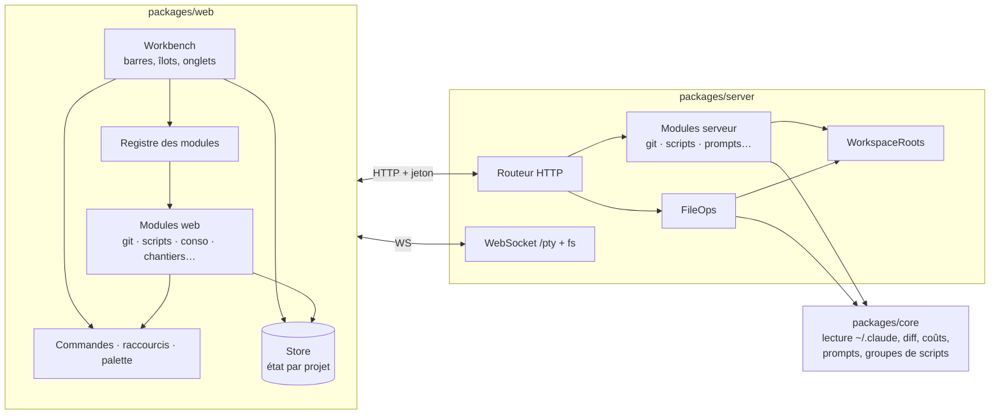
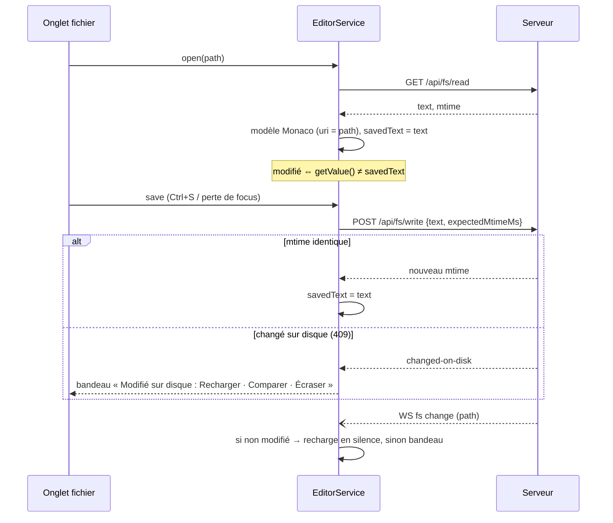

# Conception — refonte de l'interface

Contrats et structure qui portent les lots de [`refonte-ui.md`](refonte-ui.md). Ce
document fixe les formes (types, routes, invariants, découpage) ; le code viendra MR par
MR, dans l'ordre de la dernière section.

Contraintes de départ, inchangées :

- `core/` reste pur : ni Electron, ni Windows, ni PTY. Tout ce qui se teste sans machine
  y vit.
- Le serveur est la seule autorité sur le disque et les processus ; le client ne parle
  qu'à l'API HTTP et au WebSocket `/pty`, derrière le jeton.
- Le client fonctionne dans un navigateur comme dans Electron ; ce qui n'existe que dans
  Electron (`window.clide`) est une amélioration, jamais une condition.

---

## 1. Vue d'ensemble



Trois nouveautés structurelles :

1. **L'état du client se range par projet** (§2) : c'est ce qui supprime les fuites entre
   projets et donne à chaque projet son dernier onglet.
2. **Un registre de modules** (§4), côté web et côté serveur : l'application ne connaît
   plus Git, les scripts ou la consommation directement.
3. **`WorkspaceRoots`** (§7) : le serveur tient la liste des racines où il accepte de lire
   et d'écrire, au lieu de croire la `root` envoyée par le client.

---

## 2. État du client

### 2.1 Forme

Ce qui dépend du projet sort de l'état global et va dans `ProjectView`.

```ts
/** Un onglet du centre : terminal, fichier, diff ou image. */
type Tab =
  | { kind: "terminal"; id: string }                       // id du PTY
  | { kind: "file"; id: string; path: string }             // id = `file:${path}`
  | { kind: "diff"; id: string; title: string; source: DiffSource }
  | { kind: "image"; id: string; path: string };

interface ProjectView {
  root: string;
  name: string;
  /** Ordre des onglets du centre ; les terminaux y figurent par leur id. */
  tabs: string[];
  /** Dernier onglet regardé ; `null` = écran d'accueil. */
  activeTab: string | null;
  /** Session choisie dans l'historique, qui remplace la session vivante dans l'îlot du bas. */
  pinnedSession: SessionSummary | null;
  bottomMode: string;           // plan | activity | files | commit | commits…
  leftActivity: string | null;  // null = colonne gauche repliée
  explorer: { expanded: string[]; selection: string[] };
}

interface State {
  projects: ProjectView[];
  activeRoot: string | null;
  terminals: Record<string, { info: TerminalInfo; owner: string }>;
  tabs: Record<string, Tab>;
  live: Record<string, LiveSession>;
  rightActivity: string | null;
  layout: Layout;
  prefs: Preferences;
  // … le reste (notifications, dialogues ouverts) inchangé
}
```

`activeTerminalId`, `selectedSession`, `followLive`, `sessionMode`, `globalTab`,
`showLeft`, `showRight`, `sessionCollapsed` disparaissent : ils sont soit dans
`ProjectView`, soit dans `Layout`, soit déduits.

### 2.2 Invariants

Chacun a son test (`web/src/state/*.test.ts`) :

| # | Invariant |
|---|---|
| I1 | Tout id de `ProjectView.tabs` désigne un onglet dont le propriétaire est ce projet. |
| I2 | `activeTab` est `null` ou appartient à `tabs`. |
| I3 | Changer de projet ne modifie aucun `ProjectView` : on retrouve l'onglet laissé. |
| I4 | Fermer l'onglet actif active son voisin **dans le même projet**, sinon `null`. |
| I5 | Un terminal n'est affiché que si `owner === activeRoot` et qu'il est `activeTab`. |
| I6 | Toute écriture dans un PTY passe par `writeToTab(root, tabId, data)`, qui refuse un onglet d'un autre projet. |
| I7 | L'îlot du bas montre `pinnedSession`, sinon la session vivante de `activeTab` s'il est un onglet Claude, sinon rien. |

### 2.3 Rattachement d'un terminal

Un seul algorithme, utilisé à l'ouverture comme à la reprise après rechargement :

```ts
/** Le projet ouvert qui contient `cwd`, par segments de chemin, le plus profond gagnant. */
function ownerOf(cwd: string, roots: string[]): string | undefined
```

- `C:\Projets\clide-docs` n'est **pas** dans `C:\Projets\clide` (comparaison par
  segments, insensible à la casse, séparateurs normalisés).
- Pas de repli sur le projet actif. Un terminal sans projet ouvert correspondant devient
  un **orphelin** : listé dans Processus, avec « Ouvrir son projet ».
- Reprendre une session (`claude --resume`) prend `ownerOf(session.cwd)` ; si le projet
  n'est pas ouvert, il l'est (`addProject`) avant l'ouverture du terminal, et l'on bascule
  dessus.

### 2.4 Persistance

`ui-state.json` passe en `version: 2`. Sont sauvés : `projects` (vues complètes, sauf
`pinnedSession`), `activeRoot`, `rightActivity`, `layout`, `prefs`, et pour chaque projet
la liste des onglets **fichier** ouverts (les terminaux se retrouvent par le serveur).
Une fonction `migrate(v1) → v2` pure, testée sur un vrai `ui-state.json` v1.

Réalisation par étapes : la MR 3 pose le format v2 (`lib/saved-state.ts`) et range dans
chaque projet son onglet actif et le mode de l'îlot du bas ; en mémoire, la disposition
et les préférences restent des champs à plat du `State`, regroupés dans le fichier
seulement. Leur regroupement en mémoire (`layout`, `prefs`) vient avec la fenêtre
Réglages (MR 7), qui les relit toutes.

---

## 3. Disposition

```
┌ Barre de titre : onglets de projet (compteur d'attention) · + ──────────────── ⚙ ┐
├──┬──────────────┬─────────────────────────────────────────┬──────────────┬──┤
│A │ Vue gauche   │ Îlot Onglets : [claude][shell][a.ts] + ⋯ │ Vue droite   │A │
│c │ (projet)     │  terminal · éditeur · diff · image      │ (global)     │c │
│t │              │                                         │              │t │
│. │  pile de     ├──── poignée (hauteur mémorisée) ────────┤  pile de     │. │
│  │  sous-vues   │ Îlot du bas : Plan Activité Fichiers    │  sous-vues   │  │
│G │              │   Commit Commits · Rédaction…           │              │D │
└──┴──────────────┴─────────────────────────────────────────┴──────────────┴──┘
```

- Composants : `Workbench`, `ActivityBar({side})`, `SideView({side})`, `Island`,
  `IslandHeader`, `Stack` (sous-vues empilées, hauteurs mémorisées), `CenterTabs`,
  `BottomIsland`, `Splitter` (existant, étendu à l'horizontale).
- `Layout` :

```ts
interface Layout {
  left: { width: number };
  right: { width: number };
  bottom: { height: number; collapsed: boolean };  // fraction du centre
  preview: number;
  /** Hauteurs des sous-vues d'une pile, par `${activité}/${vue}`. */
  stacks: Record<string, number>;
}
```

- Replier une colonne = mettre son activité à `null` (cliquer l'icône active). Le repli
  n'est plus un booléen à part.
- Le bloc Git de la barre de titre (`GitChip`) disparaît au profit de l'activité Git ; les
  réglages quittent la colonne droite pour la fenêtre (§9).

---

## 4. Modules

Un module est interne, fiable, compilé avec l'application. Le contrat sert à découper,
pas à isoler : pas de bac à sable, pas de modèle de vue déclaratif (les vues restent des
composants React, avec shadcn et les jetons de Clide).

### 4.1 Côté web

```ts
interface WebModule {
  id: string;                       // "git", "scripts", "consumption"…
  title: string;
  activities?: Activity[];
  bottomViews?: BottomView[];
  commands?: Command[];
  contextMenus?: ContextMenuContribution[];
  preferences?: PreferenceSection;  // section de la fenêtre Réglages
  tabStatus?: (tab: Tab, root: string) => ReactNode;  // pastilles d'en-tête
}

interface Activity {
  id: string;
  side: "left" | "right";           // gauche = projet, droite = global
  icon: LucideIcon;
  title: string;
  order: number;
  views: SideViewDef[];             // plusieurs = pile
  badge?: (ctx: ModuleContext) => number | "dot" | undefined;
}

interface SideViewDef {
  id: string;
  title: string;
  render: (ctx: ModuleContext) => ReactNode;
  actions?: HeaderAction[];         // boutons de l'en-tête d'îlot
}

interface BottomView {
  id: string;
  title: string;
  icon: LucideIcon;
  order: number;
  render: (ctx: ModuleContext & { session?: ShownSession }) => ReactNode;
}

interface ModuleContext {
  root: string | null;              // projet actif (null côté droit si aucun)
  api: typeof api; post: typeof post;
  openTab: (tab: Omit<Tab, "id">) => void;
  runInTerminal: (req: RunRequest) => string;       // renvoie l'id d'onglet
  notify: (message: string, tone?: Tone) => void;
  prompt: (req: PromptRequest) => Promise<string | undefined>;
}
```

`modules/index.ts` exporte la liste ; `Réglages › Modules` range les identifiants
désactivés dans `prefs.disabledModules`. Un module désactivé ne contribue plus rien : ni
barre, ni vue, ni commande, ni menu.

### 4.2 Côté serveur

```ts
interface ServerModule {
  id: string;
  routes?: Record<string, Handler>;      // montées sous /api/<id>/…
  mutations?: Record<string, Mutation>;
  start?: (ctx: ApiContext) => void | Promise<void>;   // surveillances
  stop?: () => void | Promise<void>;
}
```

Le routeur fusionne les routes de base et celles des modules ; deux modules ne peuvent
pas déclarer le même chemin (échec au démarrage, testé). Un module désactivé côté client
garde ses routes : la désactivation est une affaire d'interface.

### 4.3 Découpage cible

| Module | Web | Serveur | Contient |
|---|---|---|---|
| `git` | activité Git (gauche), vues bas Commit et Commits, `tabStatus` branche | `platform/git-actions`, `review`, `git.ts` | branches, statut, commit, journal, MR/CI, pull multi-dépôts |
| `worktrees` | vue dans l'activité Git | `GitWorktrees` | worktrees et sessions rattachées |
| `scripts` | activité Scripts (gauche) | `ScriptStore`, groupes | scripts, lancements, groupes (§11) |
| `consumption` | activité Consommation (droite) | `usage`, `costs` | limites du forfait, coûts |
| `chantiers` | activité Chantiers (droite) | `work/chantiers` | tickets, branches, MR |
| `preview` | bouton d'outils, panneau à côté du terminal | `preview/*` | serveur de dev |
| `diagram`, `writeup` | vues du bas | routes existantes | schéma, rédaction |
| `prompts` | section de l'activité Skills, palette `/` | stockage (§10) | prompts enregistrés |

Restent dans le cœur de l'application : explorateur, éditeur, terminaux, historique,
recherche, skills, MCP, processus, notifications, réglages.

---

## 5. Commandes, raccourcis, palette

```ts
interface Command {
  id: string;                       // "git.commit", "terminal.newClaude"…
  title: string;                    // chaîne source française, passée à t()
  category?: string;
  icon?: LucideIcon;
  when?: WhenClause;                // visible / exécutable seulement si vrai
  run: (ctx: CommandContext, arg?: unknown) => void | Promise<void>;
}

type WhenKey =
  | "projectOpen" | "editorFocus" | "terminalFocus" | "claudeTab"
  | "gitRepo" | "explorerFocus" | "paletteOpen";
type WhenClause = WhenKey | { not: WhenKey } | { all: WhenClause[] };

interface Keybinding { command: string; key: string; when?: WhenClause; arg?: unknown }
```

- **Préréglages** : `keymaps/vscode.ts` (défaut) et `keymaps/jetbrains.ts` exportent des
  `Keybinding[]`. Effectif = préréglage ⊕ surcharges de `prefs.keybindings` (une
  surcharge `key: null` retire la touche).
- **Conflits** : deux liaisons sur la même touche dont les `when` peuvent être vrais en
  même temps. Détection pure, testée ; l'éditeur de raccourcis les signale.
- **Portée** : `editorFocus` et `terminalFocus` sont exclusifs. Dans un terminal, seules
  les liaisons marquées globales sont interceptées ; le reste part au shell (`Ctrl+C`,
  `Ctrl+R` de PowerShell…).
- **Palette** : des fournisseurs par préfixe.

```ts
interface PaletteProvider {
  prefix: "" | ">" | "@" | "/" | "#";
  placeholder: string;
  search: (query: string, signal: AbortSignal) => Promise<PaletteItem[]>;
}
// ""  fichiers du projet (index côté serveur, correspondance floue)
// ">" commandes (récentes d'abord, raccourci affiché)
// "@" sessions de l'historique
// "/" skills et prompts enregistrés → insérés dans l'onglet Claude
// "#" recherche plein texte (SearchIndex existant)
```

La liste des onglets globaux n'existe plus en double : la palette lit le registre des
modules.

---

## 6. Menus

```ts
type MenuItem =
  | { kind: "item"; label: string; icon?: LucideIcon; command?: string; run?: () => void;
      shortcut?: string; danger?: boolean; disabled?: boolean; checked?: boolean }
  | { kind: "submenu"; label: string; icon?: LucideIcon; items: MenuItem[] }
  | { kind: "separator" };
```

Un seul composant rend `MenuButton` (déroulant) et `ContextMenu` (au curseur, borné à la
fenêtre, sous-menus qui s'ouvrent du côté où il reste de la place). Clavier : flèches,
`→` ouvre un sous-menu, `Échap` referme d'un niveau.

Menus de la barre d'onglets du centre :

```
[+]  Claude              Ctrl+Maj+T
     Claude avec le modèle ▸  Défaut · Opus · Sonnet · Haiku   (listModels)
     Claude dans un worktree…
     Shell               Ctrl+Maj+`
     ───────
     Capture d'écran → prompt
[⋯]  Changer de modèle ▸       (onglet Claude actif : envoie /model)
     Aperçu du serveur de dev  ● si un serveur tourne
     ───────
     Fermer les autres onglets
```

---

## 7. Fichiers

### 7.1 `WorkspaceRoots`

```ts
class WorkspaceRoots {
  /** Racines du client : projets ouverts et leurs dossiers liés, relus à chaque sauvegarde de ui-state. */
  update(projects: string[]): Promise<void>;
  /** Chemin absolu résolu, ou exception si hors de toute racine autorisée. */
  resolve(path: string): string;
  /** Racine qui contient `path` (la plus profonde). */
  rootOf(path: string): string | undefined;
}
```

Toutes les routes de fichiers prennent des **chemins absolus** et passent par
`resolve`. Plus de `root` fourni par le client comme borne. Les liens symboliques et
jonctions sont résolus (`realpath`) avant la vérification.

### 7.2 API

| Route | Corps / paramètres | Réponse | Règles |
|---|---|---|---|
| `GET /api/fs/read` | `path` | `{ text, encoding, eol, mtimeMs, size }` ou `{ binary: true }` | 5 Mo max pour du texte |
| `POST /api/fs/write` | `{ path, text, expectedMtimeMs }` | `{ mtimeMs }` | 409 `changed-on-disk` si le mtime ne correspond pas ; écriture atomique (fichier temporaire + `rename`) ; garde l'EOL et le BOM lus |
| `POST /api/fs/create` | `{ path, kind: "file" \| "dir" }` | `{ path }` | 409 si existe |
| `POST /api/fs/rename` | `{ from, to }` | `{ path }` | même dossier ; 409 si `to` existe |
| `POST /api/fs/copy` | `{ sources[], targetDir, onConflict }` | `{ results[] }` | `onConflict: "ask" \| "keepBoth" \| "replace"` ; `ask` renvoie les collisions sans rien faire |
| `POST /api/fs/move` | idem | idem | entre racines autorisées seulement |
| `POST /api/fs/trash` | `{ paths[] }` | `{ trashed[] }` | Corbeille (`platform/trash.ts` existant) |
| WS `{ t: "watch", paths[] }` | — | `{ t: "fs", changes: { path, kind }[] }` | surveillance des dossiers dépliés et des fichiers ouverts, agrégée sur 150 ms |

`keepBoth` nomme `nom (2).ext`, `nom (3).ext`… (fonction pure dans `core/files`,
testée). Aucune route n'écrase sans `replace` explicite.

### 7.3 Annuler

Pile côté client, par projet, des opérations réussies avec leur inverse :

| Opération | Inverse |
|---|---|
| create | trash |
| rename a → b | rename b → a |
| move a → dir | move dir/a → dossier d'origine |
| copy a → b | trash b |
| trash | aucun (« restaurer depuis la Corbeille » affiché dans la notification) |

L'inverse est refusé si la cible a changé depuis (mtime) : on prévient au lieu d'écraser.

### 7.4 Explorateur

- Arbre virtualisé (les `node_modules` dépliés ne doivent pas figer l'interface) ;
  `explorer.expanded` et `selection` dans `ProjectView`.
- `fileIcon(name, isDir, open, theme)` : fonction pure sur la table Catppuccin
  (`fileNames`, puis extensions de la plus longue à la plus courte, puis défaut), testée.
- Presse-papiers **interne** à Clide (`{ op: "copy" | "cut", paths }`) ; celui de Windows
  plus tard, par Electron.
- Double-clic : fichier texte → onglet éditeur ; image → onglet image ; binaire ou
  exécutable → application par défaut (règle `RUNNABLE` actuelle conservée).

---

## 8. Éditeur



- `EditorService` (hors de React, comme les terminaux) : une instance Monaco, un modèle
  par chemin, l'état de vue sauvé à chaque changement d'onglet. Monaco se charge à la
  demande (import dynamique) pour ne pas alourdir le démarrage.
- Renommer ou déplacer un fichier ouvert (§7) remplace l'uri du modèle sans perdre
  l'historique d'annulation.
- Diff : `DiffSource = { kind: "session"; sessionId; path } | { kind: "git"; root; path;
  ref: "HEAD" | "index" | commit } | { kind: "text"; original; modified }`, résolu par une
  route, rendu par l'éditeur de diff Monaco en lecture seule.
- Markdown : bascule code / côte à côte / aperçu, avec le rendu Markdown déjà utilisé par
  le panneau Plan.

---

## 9. Réglages en fenêtre

```ts
interface Preferences {
  language: Language;
  theme: Theme; look: LookPair;
  terminalFont: TerminalFont;
  editor: { fontFamily: string; fontSize: number; wordWrap: boolean; minimap: boolean; autoSave: "off" | "focusLost" };
  keymap: "vscode" | "jetbrains";
  keybindings: Keybinding[];          // surcharges
  showCosts: boolean;                 // masque les coûts partout (historique, activité, en-tête)
  disabledModules: string[];
}
```

Sections : Général, Apparence, Éditeur, Terminal, Raccourcis, Historique et coûts, Claude
Code (`SettingsForm` + JSON), Notifications, Modules, puis celles des modules
(`WebModule.preferences`). Ouverture : roue en bas de la barre droite, `Ctrl+,`, palette.
Une recherche filtre les lignes par libellé.

`showCosts` : un seul composant `<Cost value={…} />` affiche un coût ; il ne rend rien
quand la préférence est coupée. Plus aucun `formatSessionCost` appelé directement dans
une vue.

---

## 10. Prompts enregistrés

```ts
interface SavedPrompt {
  id: string;                     // uuid
  label: string;                  // « Brainstorm »
  text: string;                   // « /sc:brainstorm {saisie} »
  mode: "insert" | "send";        // insérer sans valider, ou envoyer
  scope: "user" | "project";
}
```

- Stockage : `%LOCALAPPDATA%\clide\prompts.json` (perso) et
  `<projet>/.claude/clide-prompts.json` (projet, versionnable), `{ version: 1, prompts:
  SavedPrompt[] }`. Lecture tolérante (entrée invalide ignorée et signalée), écriture
  atomique.
- Routes (module `prompts`) : `GET /api/prompts?root=`, `POST /api/prompts/save`,
  `/remove`, `GET /api/prompts/suggestions?root=`.
- Variables, résolues **côté client** au lancement : `{sélection}` (éditeur),
  `{fichier}` (chemin de l'onglet fichier actif), `{branche}` (module git),
  `{saisie}` (demandée par `prompt()`). Fonction pure `expand(text, values)`, testée ;
  une variable sans valeur arrête l'envoi avec un message.
- Envoi : dans l'onglet Claude actif du projet (I6), en *bracketed paste* pour qu'un
  texte multiligne ne s'envoie pas ligne à ligne, puis `\r` si `mode: "send"`. Sans onglet
  Claude : proposer d'en ouvrir un et d'y envoyer le prompt une fois prêt.
- Suggestions : fonction de `core` qui compte, dans les transcripts indexés, les messages
  utilisateur commençant par `/` (commande + premier mot), sur 30 jours, au moins 3
  occurrences, hors prompts déjà enregistrés.
- Chaque prompt est aussi une commande (`prompt.run:<id>`) : raccourci assignable,
  présent dans la palette `/`.

---

## 11. Scripts en parallèle

```ts
/** Identité stable d'un script : un onglet par script, réutilisé au relancement. */
type ScriptKey = `${string}::${string}::${string}`;   // racine :: source (package.json…) :: nom

interface ScriptGroup {
  id: string;
  label: string;                  // « Tout démarrer »
  scripts: { root: string; source: string; name: string }[];
}
```

- `runScript(key)` : si un onglet porte ce `ScriptKey` et que son processus tourne → on
  le montre ; s'il est terminé → on relance dedans ; sinon nouvel onglet shell dans
  `root`, titré `projet › script`. L'association `ScriptKey → terminalId` est tenue par
  le **serveur** (dans `TerminalInfo.script`), pour survivre à un rechargement.
- Groupes : `<projet>/.claude/clide-scripts.json` `{ version: 1, groups: ScriptGroup[] }`.
  Chemins des dossiers liés stockés **relatifs** au projet, pour que le fichier se partage.
- « Arrêter le groupe » : `Ctrl+C` à chaque onglet, puis arrêt de l'arbre de processus
  après 5 s pour ceux qui ne rendent pas la main (arrêt gardé existant de Processus).
- Vue « En cours » : onglets de scripts vivants × ports d'écoute (`platform/listening.ts`
  existant).
- Détection au-delà de npm (`make`, `cargo`, `go`, `python`, `*.ps1`, `*.sh`) :
  fournisseurs dans `core/scripts`, un par écosystème, chacun avec ses fixtures.

---

## 12. Tests

| Domaine | Où | Quoi |
|---|---|---|
| Invariants I1-I7, `ownerOf`, `migrate` | `web/src/state/*.test.ts` | cas multi-projets, rechargement |
| `WorkspaceRoots`, routes `fs/*` | `server/test` | dossier temporaire ; sortie de racine, jonction, collision, 409 |
| `keepBothName`, `fileIcon`, `expand`, conflits de raccourcis, suggestions de prompts, fournisseurs de scripts | `core/test` | fonctions pures |
| Routeur de modules | `server/test` | collision de routes, module désactivé |
| Éditeur (enregistrement, changement sur disque) | `web` + serveur de test | scénario de la séquence §8 |

`pnpm test` et `pnpm typecheck` verts à chaque MR, comme aujourd'hui.

---

## 13. Découpage en MR

Chaque MR se livre seule et laisse l'application utilisable.

| # | MR | Contenu | Dépend |
|---|---|---|---|
| 1 | `fix/project-isolation` | §2.2 I1-I7, §2.3 `ownerOf`, onglet actif par projet, `writeToTab` | — |
| 2 | `feat/workspace-roots` | §7.1, routes existantes (`files/open`, `files`, `preview`) passées dessus | — |
| 3 | `feat/state-v2` | `ProjectView`, `Layout`, `Preferences`, `migrate`, persistance complète | 1 |
| 4 | `feat/menus` | composant `MenuItem`, menus `+` et `⋯` du terminal | — |
| 5 | `feat/commands` | registre `Command`, `when`, préréglages VS Code / JetBrains, palette à préfixes (`>`, `@`, `#`) | 3 |
| 6 | `feat/layout` | barres d'activité, îlot du bas séparé, piles, `GitChip` retiré de la barre de titre | 3, 4 |
| 7 | `feat/settings-window` | fenêtre Réglages, `showCosts` et `<Cost>` | 3 |
| 8 | `feat/modules` | contrats §4, routeur fusionné, Scripts et Consommation convertis | 6 |
| 9 | `feat/explorer` | arbre, icônes, opérations de fichiers §7.2-7.4 | 2, 4 |
| 10 | `feat/editor` | `EditorService`, onglets fichier / image / diff, palette sans préfixe | 9 |
| 11 | `feat/git-module` | module git : Modifications, Branches, Commit et Commits en bas, diffs | 8, 10 |
| 12 | `feat/prompts` | §10, palette `/` | 5, 8 |
| 13 | `feat/script-runs` | §11 | 8 |
| 14 | `feat/skills` | badges de mode, insertion, création → éditeur | 10 |

Les MR 1 et 2 corrigent des défauts actuels : à faire d'abord, quel que soit le reste.

## 14. Risques et points ouverts

- **Taille de Monaco** (~5 Mo) : chargé à la demande ; à mesurer dans l'installateur.
- **Surveillance de fichiers sous Windows** : `fs.watch` récursif perd des événements sur
  les gros arbres ; ne surveiller que les dossiers dépliés et les fichiers ouverts, et
  relire au retour du focus.
- **Raccourcis dans les terminaux** : `Ctrl+P`, `Ctrl+R`, `Ctrl+B` servent aussi à
  PowerShell et aux outils ; la liste des touches interceptées dans un terminal doit
  rester courte et réglable.
- **Git exécuté par le serveur** (état actuel de Clide) plutôt que tapé dans un terminal
  visible (choix de ClaudeTerm) : on garde l'exécution serveur, mais chaque commande
  lancée s'inscrit dans une sortie « Git » consultable, pour que rien ne soit caché.
- Décisions encore à prendre, reprises de `refonte-ui.md` : emplacement du commit (ici :
  en bas), coûts masqués partout (ici : oui), arbre plutôt que navigation (ici : arbre).
