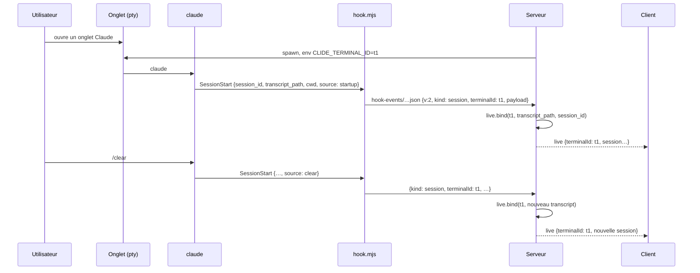

# Conception — le bloc session suit vraiment l'onglet

Contrats et structure de la piste 10 de [`pistes.md`](pistes.md). Ce document fixe
les formes (types, routes, invariants, découpage) ; le code viendra MR par MR, dans
l'ordre de la dernière section.

Contraintes de départ, inchangées :

- `core/` reste pur : ni Electron, ni Windows, ni PTY.
- Le serveur est la seule autorité sur le disque et les processus ; le client ne
  parle qu'à l'API HTTP et au WebSocket, derrière le jeton.
- `settings.json` appartient à Claude Code : on y pose et retire **nos** entrées,
  reconnues à leur script, jamais celles d'un autre outil.

---

## 1. Le constat

Le bloc sous le terminal (plan, activité, fichiers…) se rafraîchit quand
`lastActivityAt` de la session suivie change. Trois défauts font qu'il ne suit pas
ce qui se passe :

1. **Le rattachement onglet ↔ session est deviné.** Les hooks de Clide ne sont pas
   installés : `settings.json` porte encore ceux d'une installation antérieure
   (`Roaming\ClaudeTerm\hook.cmd`), qui déversent dans un dossier que rien ne lit.
   Sans hook, le serveur cherche le transcript **créé** après l'ouverture de
   l'onglet, dans le dossier de l'onglet. Ce pari se perd après un `/clear` ou une
   reprise dans l'onglet (nouveau transcript, l'onglet reste sur l'ancien), quand
   deux onglets du même projet attendent leur premier prompt (le premier ouvert
   s'approprie le transcript du second), ou quand la session part d'un sous-dossier.
2. **Un clic dans History détache le bloc sans le dire**, même quand la session
   choisie est celle de l'onglet actif : le bloc reste figé jusqu'au prochain clic
   sur un onglet de terminal.
3. **Changer de projet par la pastille ne change pas d'onglet actif.** L'onglet
   actif reste celui de l'autre projet ; le bloc n'a plus rien à suivre et retombe
   sur la dernière sélection de History, ou sur rien, jusqu'à un clic sur un onglet.

Le mode Fichiers avait une limite à part : il ne voyait que les fichiers écrits
par les outils d'édition de Claude Code, ceux dont il garde une sauvegarde. Il lit
désormais aussi le relevé `bashEditDiff` des commandes Bash — sans sauvegarde,
donc sans restauration.

---

## 2. Vue d'ensemble

```mermaid
flowchart LR
  subgraph pty[Onglet · pty]
    env[CLIDE_TERMINAL_ID=id] --> claude[claude]
  end
  claude -- SessionStart · UserPromptSubmit · Stop · Notification --> hook[hook.mjs<br/>enveloppe v2 : kind, terminalId, payload]
  hook --> spool[(hook-events/)]
  spool --> watcher[NotificationWatcher]
  watcher -- terminalId, transcriptPath, sessionId --> bind[LiveSessions.bind]
  bind --> poll[poll toutes les 1,5 s]
  poll -- WS live --> store[(store.live[terminalId])]
  store --> shown[TerminalArea.shown<br/>followLive · lastTab]
  shown --> panels[Plan · Activité · Fichiers…]
```

Aujourd'hui, la flèche `terminalId` n'existe pas : le serveur retrouve l'onglet par
le `cwd` de l'événement, et rien ne tire `SessionStart`. Côté client, `followLive`
et l'onglet actif sont posés sans règle commune.

---

## 3. Rattachement exact par les hooks

### 3.1 L'onglet se nomme dans son environnement

`PtyManager.open` ajoute `CLIDE_TERMINAL_ID=<id>` à l'environnement du pty, à côté
du nettoyage des `CLAUDE_CODE_*`. PowerShell le transmet à `claude`, qui le
transmet à ses hooks : les hooks « command » héritent de l'environnement du
processus `claude` (référence : guide des hooks de Claude Code). Le cas de
`claude` tapé dans un shell est couvert par la même variable, sans rien ajouter.

Un `claude` lancé **hors** de Clide n'a pas la variable : ses événements arrivent
sans `terminalId`, et le routage par dossier reste le secours (§ 3.4).

### 3.2 Le script de hook : enveloppe v2

```ts
/** Ce que hook.mjs dépose dans hook-events/, un fichier par événement. */
interface HookEnvelope {
  v: 2;
  kind: NotificationKind;
  receivedAt: string;
  /** Onglet qui a lancé la session, lu dans CLIDE_TERMINAL_ID ; absent hors de Clide. */
  terminalId?: string;
  payload: unknown;
}
```

Le script reste ce qu'il est — déverser, rendre la main, ne jamais échouer — et
gagne deux champs. `hooksStatus` relit le fichier déposé et le compare à
`hookScript()` : différent, l'installation est **à mettre à jour** ; le panneau
Alertes le dit et « Installer » réécrit le script et les entrées. Rien n'est réécrit
sans ce geste : `settings.json` ne bouge pas tout seul.

### 3.3 Un événement de plus : `SessionStart`

```ts
type NotificationKind = "permission" | "idle" | "stop" | "resume" | "session" | "other";

const HOOK_DEFINITIONS = [
  { event: "Notification", matcher: "permission_prompt", kind: "permission" },
  { event: "Notification", matcher: "idle_prompt|agent_needs_input", kind: "idle" },
  { event: "Stop", kind: "stop" },
  { event: "UserPromptSubmit", kind: "resume" },
  { event: "SessionStart", kind: "session" },
];
```

`SessionStart` tire au démarrage, à la reprise, après `/clear`, après une
compaction et à un fork (`source` : `startup`, `resume`, `clear`, `compact`,
`fork`). Sans `matcher`, on les reçoit tous : c'est le seul moment où Claude Code
dit lui-même quel transcript l'onglet suit désormais, avant tout prompt. `session`
n'est pas une alerte : il ne pose pas de pastille et n'est pas montré dans
Alertes ; il rattache.

`SessionEnd` n'est pas pris : la fin de `claude` dans l'onglet est déjà vue par
la séquence OSC du profil, qui délie l'onglet.

Le veilleur lit deux champs de plus :

```ts
interface ClaudeNotification {
  // … champs actuels
  /** Onglet d'origine, quand l'événement vient d'un claude lancé par Clide. */
  terminalId?: string;
  /** Pour `session` : startup | resume | clear | compact | fork. */
  source?: string;
}
```

### 3.4 Routage : par l'onglet, le dossier en secours

```ts
/** L'onglet visé par un événement de hook. */
function terminalOf(manager: PtyManager, n: ClaudeNotification): TerminalInfo | undefined {
  const named = n.terminalId ? manager.get(n.terminalId) : undefined;
  return named ?? (n.cwd ? manager.findByCwd(n.cwd) : undefined);
}
```

La remontée au client (`notification`, `resume`) passe par cette fonction : une
alerte d'une session lancée ailleurs dans le dossier d'un onglet allume cet
onglet, comme aujourd'hui. Le **rattachement**, lui, n'accepte que l'onglet
nommé : une session lancée hors de Clide dans le même dossier — un autre
éditeur, un `claude -p` — tirerait sinon `SessionStart` à chaque démarrage et
volerait l'onglet. Sans `terminalId`, rien n'est rattaché ; la recherche par
date (§ 3.5) reste le secours.



`bind` est déjà idempotent (même chemin : rien). Tout événement porteur de
`transcript_path` continue de rattacher, comme aujourd'hui ; `session` ne fait
qu'arriver plus tôt et à chaque changement de transcript.

### 3.5 Sans hooks : la recherche par date, arbitrée

Quand rien n'est installé, `findLiveTranscript` reste. Un seul changement, sans
coût : les onglets non rattachés sont parcourus **du plus récent au plus ancien**
(`since` décroissant). Un transcript créé après l'ouverture du second onglet lui
revient, au lieu d'être pris par le premier, dont l'attente est plus longue et
dont le transcript, s'il vient, sera plus récent encore.

### 3.6 Anciennes installations

```ts
/** Hooks posés par une installation antérieure, reconnus à leur script. */
const LEGACY_HOOK_SCRIPTS = [
  join(legacyAppDataDir(), "hook.mjs"),               // claude-ide
  join(roamingDir(), "ClaudeTerm", "hook.cmd"),        // premier nom
];

interface HooksStatus {
  installed: boolean;
  outdated: boolean;                 // script déposé ≠ hookScript()
  kinds: NotificationKind[];
  /** Entrées d'anciennes installations encore dans settings.json. */
  legacy: { script: string; events: string[] }[];
  scriptPath: string;
  eventsPath: string;
  settingsPath: string;
}
```

`migrateHooks` est généralisé à cette liste et tourne **à chaque démarrage** du
serveur, plus seulement quand des données ont été déplacées : une entrée
ancienne trouvée est retirée et nos hooks sont posés, comme aujourd'hui pour
`claude-ide` — l'utilisateur avait consenti aux hooks, on ne change que le script
appelé. Le journal le dit (« hooks ClaudeTerm repointés »). Si l'écriture échoue
(`settings.json` illisible), `legacy` reste non vide et le panneau Alertes le
montre avec un bouton « Retirer » (route `/api/notifications/prune-legacy`).

Les fichiers laissés dans l'ancien dossier `events` ne sont pas touchés : ils ne
sont pas à nous.

---

## 4. Le bloc suit l'onglet (client)

### 4.1 Suivi et sélection

Deux sources possibles pour la session montrée : la session vivante de l'onglet
actif (`live[activeTerminalId]`), ou celle choisie dans History
(`selectedSession`). Une seule règle décide :

```
shown = followLive && current ? current
      : selectedSession        ? selectedSession
      : rien
detached = !followLive && current !== undefined
```

- **Choisir dans History la session de l'onglet actif ne détache pas** :
  `followLive` reste vrai quand `session.sessionId === live[activeTerminalId]?.sessionId`.
  Le bloc continue de se rafraîchir.
- **Choisir une autre session détache**, comme aujourd'hui, et le dit (§ 4.2).
- **Cliquer un onglet de terminal, en ouvrir un, changer de projet** rattachent
  (`followLive: true`).

### 4.2 L'en-tête dit « détaché »

Quand `detached` est vrai, l'en-tête du bloc montre, après le titre de la session,
une puce « détaché » dont l'info-bulle dit qu'un clic ramène à l'onglet ; le clic
remet `followLive: true`. Le titre se tronque, la puce reste entière. La puce
n'apparaît que s'il y a un onglet vivant à suivre : sans session vivante, montrer
une session de History n'est pas un détachement.

### 4.3 Changer de projet réactive son dernier onglet

```ts
interface State {
  // …
  /** Dernier onglet actif de chaque projet, par racine ; jamais persisté. */
  lastTab: Record<string, string>;
}

/** Rend un projet actif avec l'onglet qu'on y regardait, ou son plus récent. */
export function activateProject(root: string): void {
  setState((current) => {
    const own = Object.entries(current.terminals).filter(([, entry]) => entry.owner === root);
    const remembered = current.lastTab[root];
    const id = remembered && own.some(([id]) => id === remembered) ? remembered : (own.at(-1)?.[0] ?? null);
    return { activeRoot: root, activeTerminalId: id, followLive: true };
  });
}
```

`focusTerminal` note `lastTab[owner] = id`. Passent par `activateProject` : la
pastille de la barre de titre, « Projet suivant / précédent », `openProject` quand
il active, `closeProject` quand il retombe sur un autre projet. Un projet sans
onglet donne `activeTerminalId: null` : le pied de la zone et le bloc ne
décrivent plus l'onglet d'un autre projet.

---

## 5. Invariants

- Un onglet Claude lancé par Clide est rattaché dès `SessionStart`, avant le
  premier prompt, et suit chaque changement de transcript (`clear`, `resume`).
- Un événement sans `terminalId` (claude lancé ailleurs) se route par dossier,
  comme aujourd'hui ; jamais vers un onglet d'un autre projet.
- `settings.json` : on n'y touche que nos entrées et celles des anciennes
  installations de Clide, reconnues à leur script ; tout le reste est préservé,
  mise en forme comprise.
- Le bloc montre toujours l'une des deux sources, et dit laquelle quand ce n'est
  pas l'onglet.
- `activeTerminalId`, s'il est non nul, appartient toujours au projet actif.

## 6. Tests

- `hook.ts` : enveloppe v2 (le script écrit `terminalId` depuis l'environnement),
  `outdated` quand le script déposé diffère, `legacy` reconnu pour `hook.cmd`
  ClaudeTerm et `hook.mjs` claude-ide, migration qui retire l'ancien et pose le
  nouveau sans toucher un hook étranger sur le même événement.
- `watcher.ts` : `parseNotification` lit `terminalId` et `source`, ignore une
  enveloppe v1 sans casser.
- `live.ts` : ordre d'arbitrage des onglets non rattachés.
- Serveur : `terminalOf` préfère l'onglet nommé, retombe sur le dossier, ignore un
  onglet fermé.
- Web (typé, vérifié en direct) : sélection de la session vivante dans History
  sans détachement, puce « détaché », `activateProject` avec et sans onglet.

## 7. Découpage

1. **Serveur — rattachement exact** : variable d'environnement, enveloppe v2,
   `SessionStart`, routage par onglet, arbitrage sans hooks, anciennes
   installations ; panneau Alertes (« à mettre à jour », « Retirer ») ; guide
   (panneau global, session).
2. **Web — le bloc dit ce qu'il suit** : règle de sélection, puce « détaché » ;
   guide (session).
3. **Web — changer de projet réactive son onglet** : `activateProject`, `lastTab`,
   appelants ; guide (index).
