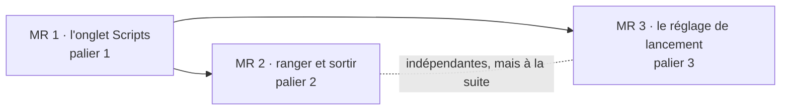

# Plan d'implémentation — les scripts sous un seul onglet

Ordonnance le travail de la piste 11, dont les contrats sont dans
[`design-onglet-scripts.md`](design-onglet-scripts.md). Trois MR, chacune livrable
seule ; la première porte l'essentiel du travail et du risque, les deux autres
s'appuient sur elle.

Règles de travail, inchangées : une fonctionnalité par commit ; commit seulement
quand `pnpm typecheck` et `pnpm test` sont verts ; vérification en direct dans
l'application avant la MR ; branche `aqn/<type>/<slug>`, PR en français, merge
avec suppression de branche. Le guide se met à jour dans la même MR que le code.

---

## Dépendances

Tout vit dans `packages/web` et `docs/guide` : le serveur ne change pas. MR 2 et
MR 3 ne dépendent pas l'une de l'autre, mais toutes deux retouchent `runScript` et
`state/terminals.ts` : les faire à la suite, pas en parallèle.

**Point d'attention** : l'application de bureau installée (`Local\Programs\Clide`)
embarque le bundle web. Rien ne change pour l'utilisateur avant `pnpm package` et
réinstallation, ou `pnpm start`.

---

## MR 1 — L'onglet Scripts

Branche `aqn/feat/scripts-tab`. Taille : la plus grosse des trois.

### Tâches

| # | Quoi | Où | Test |
|---|---|---|---|
| 1.1 | Module pur : `placementOf` (sans `placed` pour l'instant), `splitTabs`, `natureOf`, `shelfGroups`, `shelfSummary`, `selectedScript`, `backTarget`, `lookAt`, `afterClose`, `tabStops` | `web/src/lib/script-shelf.ts` | `script-shelf.test.ts` : la liste du § 6 de la conception, sauf `offersBar` et le groupe Shells |
| 1.2 | État gardé : `Project.scripts` (`selected`, `back`, `commands`, `folded`), défaut dans `DEFAULT_PROJECT` et `toProject`, lecture tolérante dans `project()` ; `widths.scripts` (220) dans `DEFAULT_LAYOUT` et `layout()` | `web/src/lib/saved-state.ts`, `web/src/state/store.ts` | `saved-state.test.ts` : projet sans `scripts`, `scripts` illisible ou partiel, `widths.scripts` absent |
| 1.3 | `tabToShow` prend un prédicat « dans la barre » et retombe sur le plus récent de la barre ; `activateProject` et `adopt` le passent | `web/src/lib/workspace.ts`, `store.ts`, `terminals.ts` | `workspace.test.ts` : retenu rendu même si c'est un script ; sinon la barre, jamais un script |
| 1.4 | `focusTerminal` et `opened` passent par `lookAt` (remplace `rememberTab` + `activeFile: null`) ; option de `focusTerminal` qui ne focalise pas xterm ; `toggleScripts()` (entrer, sortir par `backTarget`, déplier le groupe du script montré) | `web/src/state/terminals.ts` | typé ; la règle est couverte par 1.1 |
| 1.5 | `closeTerminal` par `afterClose` ; élagage de `commands` à la fermeture et dans `adopt` | `terminals.ts` | idem |
| 1.6 | `runScript` : `commands[id]` à la reprise, `pendingCommands` par clé jusqu'à `opened` ; onglet où Claude tourne montré sans rien taper ; `runningScriptTab` ignore Claude ; `interruptTerminal(id, { show })` | `terminals.ts` | idem |
| 1.7 | `relaunch(id)` : suite de tests par `tests.ts`, en cours (Ctrl+C, attente ≤ 10 s par `subscribe`, une seule relance en attente par onglet), fini, shell terminé ; avec `toggleScripts` et les gestes en nombre, dans un module à part, `tests.ts` dépendant de `terminals.ts` | nouveau `web/src/state/shelf.ts`, `web/src/state/tests.ts` (`lastTargets`, `rerunSuite`) | idem |
| 1.7 bis | Lecture seule au prompt : `acceptsInput`, `typeAsUser` pour la frappe, le collage, le dépôt, « Insérer le chemin » et la capture ; `isTerminalReply` laisse passer les réponses de xterm ; rappel `refusedInput` en bas du cadre | `terminals.ts`, nouveau `web/src/lib/terminal-input.ts`, `TerminalArea.tsx`, `commands.ts` | `terminal-input.test.ts` |
| 1.8 | `sessionTabOf` ; le passage automatique sur Plan (message `live`) le suit ; `claudeTabFor` préfère `back.tab` | `store.ts`, `terminals.ts` | idem |
| 1.9 | `TerminalArea` : barre = `splitTabs(...).bar` ; onglet épinglé hors de `Reorderable` ; liste à gauche du cadre unique des hôtes, avec son `Splitter` ; accueil sur `!status && !activeFile` ; pied sur `live[status.id]`, bloc sur `live[sessionTabOf]` | `web/src/components/TerminalArea.tsx`, nouveau `web/src/components/ScriptsShelf.tsx` (onglet épinglé, liste en `tree`, en-têtes repliables) | en direct |
| 1.10 | `ScriptToolbar` (■, ↻ ou ▷) au coin haut droit, à la place de `ClaudeToolbar` sur un script | `web/src/components/TerminalMenus.tsx` | en direct |
| 1.11 | Vue Scripts : « En cours » et ses ■ ignorent un onglet où Claude tourne (par `runningScriptTab`) ; la marge en profite sans changement | `web/src/components/panels/scripts.tsx` | en direct |
| 1.12 | Commandes : `tab.scripts` sur `Ctrl+Maj+X`, `Alt+4` dans le préréglage JetBrains ; `tab.next`/`previous` par `tabStops` ; `moveLeft`/`moveRight` sans effet dans Scripts ; « Fermer les autres onglets » limité à la barre | `web/src/state/commands.ts`, `web/src/lib/keymap.ts`, `TerminalMenus.tsx` (`tabItems`) | `keymap.test.ts` : `Alt+4` hors du terminal seulement |
| 1.13 | Chaînes anglaises | `web/src/i18n/en.ts` | — |
| 1.14 | Guide : section « L'onglet Scripts » dans `terminaux.md` (bascule, liste, natures, relancer, barre flottante) ; « Lancer un script » dans `projet.md` (sa ligne dans l'onglet Scripts plutôt que son onglet) ; `Ctrl+Maj+X` dans le tableau de `personnaliser.md` | `docs/guide/` | `pnpm docs:build` |

### Ordre interne

1.1 → 1.2 → 1.3, testés seuls ; puis 1.4 → 1.5 → 1.6 → 1.7 (chacun s'appuie sur le
précédent dans `terminals.ts`) et 1.8 en parallèle ; 1.9 → 1.10 → 1.11 ; 1.12 ;
1.13 → 1.14 pour finir.

### Vérification en direct

Selon la recette habituelle : serveur de test isolé (`LOCALAPPDATA` et `APPDATA`
dans le scratchpad, `CLIDE_PORT` fixe, `CLIDE_NO_OPEN=1`), piloté par Playwright.
Un projet de brouillon dont le `package.json` porte :

- `dev` : un petit serveur Node qui écoute et annonce `Local: http://localhost:<port>` ;
- `storybook` : le même sur un autre port, pour deux lignes dans Serveurs ;
- `build` : `node -e "process.exit(0)"` ;
- `lint` : `node -e "process.exit(1)"`, pour un échec.

Puis :

1. Sans script lancé : l'onglet Scripts est grisé, son infobulle le dit.
2. Lancer `dev`, `storybook`, `build`, `lint` depuis la vue Scripts : la barre ne
   gagne aucun onglet ; l'onglet épinglé compte 2, en rouge (`lint`) ; la liste
   montre Serveurs, Build et Vérifications avec leurs en-têtes, les adresses sous
   les serveurs.
3. Depuis un onglet Claude, cliquer Scripts puis le recliquer : retour à l'onglet
   Claude. Même chose avec un fichier ouvert : retour au fichier. Pendant ce
   temps, le bloc du bas montre la session de l'onglet Claude.
4. Replier Serveurs : l'en-tête garde son point ambre ; « Aller à l'onglet » sur
   `dev` dans la vue Scripts le déplie et le montre.
5. ↻ sur `dev` en cours, depuis la ligne puis depuis la barre flottante : il
   s'arrête et repart, l'adresse revient. ▷ sur `build` une fois fini.
6. Taper `npm i` dans le shell de `dev` arrêté, puis ▷ : c'est `dev` qui repart,
   pas `npm i`.
7. Recharger la page : même liste, même script choisi, mêmes groupes repliés ; ▷
   relance toujours.
8. Fermer les scripts un à un : chaque fermeture montre le voisin, la dernière
   ramène dans la barre. Fermer un onglet de la barre n'entre jamais dans Scripts.
9. `Ctrl+Maj+X` bascule, depuis le terminal comme depuis l'éditeur ;
   `Ctrl+Maj+Page suiv.` compte l'onglet Scripts pour un arrêt ; « Fermer les
   autres onglets » laisse les scripts.
10. Une suite de tests (le projet Clide lui-même, `packages/core`) lancée depuis la
    vue Tests arrive dans Tests ; ▷ depuis sa ligne met à jour la vue Tests.
11. Taper `claude` dans le shell de `build`, fini : rien ne passe, le rappel
    s'affiche. Taper dans `dev` en cours : la frappe passe.
12. Un onglet Claude du brouillon, un prompt minuscule, puis l'onglet Scripts : le
    bloc du bas garde sa session, le pied décrit le script montré.

Vérifier à chaque bascule et après chaque geste du `Splitter` que la dernière ligne
du terminal n'est pas coupée.

Nettoyage : tuer l'arbre de processus du serveur de test (`taskkill /T`, PID trouvé
par sa ligne de commande), supprimer `.playwright-mcp/` et le dossier
`~/.claude/projects/<chemin du brouillon>`.

### Sortie

Commit `feat(terminal): group script tabs under a pinned Scripts tab`. PR, merge.

---

## MR 2 — Ranger et sortir

Branche `aqn/feat/scripts-placement`. Taille : moyenne.

| # | Quoi | Où | Test |
|---|---|---|---|
| 2.1 | `scripts.placed` : lecture tolérante, élagage à la fermeture et dans `adopt` ; `placementOf` le consulte | `saved-state.ts`, `terminals.ts`, `script-shelf.ts` | `saved-state.test.ts`, `script-shelf.test.ts` (rangement, groupe Shells, script rangé de nouveau dans son groupe) |
| 2.2 | Menus contextuels : « Ranger dans Scripts » sur un shell vivant de la barre, jamais sur un onglet Claude ; « Sortir des scripts » sur une ligne | `TerminalMenus.tsx` (`tabItems`), `ScriptsShelf.tsx` | en direct |
| 2.3 | ⤴ « Sortir des scripts » dans `ScriptToolbar` | `TerminalMenus.tsx` | en direct |
| 2.4 | Chaînes anglaises ; guide `terminaux.md` : ranger, sortir, Claude dans un shell rangé | `en.ts`, `docs/guide/terminaux.md` | `pnpm docs:build` |

**Vérification en direct** : ranger un shell de la barre, y taper une commande
longue à la main : il paraît sous Shells, reste interactif, avec ■ mais sans ▷ ni
↻. Le sortir, le ranger de nouveau, recharger : le rangement tient. Sortir `dev` :
il rejoint la barre, et le relancer depuis la vue Scripts le reprend là, sans
second onglet. Le menu d'un onglet Claude ne propose pas « Ranger dans Scripts ».
Taper `claude` dans le shell rangé : il reste dans Scripts, sans fenêtre ; Ctrl+C
deux fois dans Claude, le shell reste où il est. Même nettoyage que MR 1.

Commit `feat(terminal): move shells in and out of the Scripts tab`.

---

## MR 3 — Le réglage de lancement

Branche `aqn/feat/script-launch-setting`. Taille : petite.

| # | Quoi | Où | Test |
|---|---|---|---|
| 3.1 | `scriptLaunch` dans `SavedPrefs`, `DEFAULT_PREFS`, `prefs()`, l'état, `restored()` et `persist()` | `saved-state.ts`, `store.ts` | `saved-state.test.ts` : absent ou faux donne `"show"` |
| 3.2 | `runScript` : bascule seulement si `focus !== false` et `scriptLaunch === "show"` ; sinon `backgroundScripts`, et `selected` prend le script lancé hors de l'onglet Scripts | `terminals.ts` | typé ; en direct |
| 3.3 | Réglages › Terminal : « Au lancement d'un script », Montrer le script · Rester où l'on est | `web/src/components/Preferences.tsx`, `en.ts` | en direct |
| 3.4 | Guide : `personnaliser.md` (Réglages) et une phrase dans « Lancer un script » de `projet.md` | `docs/guide/` | `pnpm docs:build` |

**Vérification en direct** : régler « Rester où l'on est » ; depuis un onglet
Claude, lancer `dev` par la vue Scripts puis par le ▷ de la marge d'un
`package.json` : on reste sur Claude, le compteur de l'onglet Scripts monte, un
clic dessus montre `dev`. « Aller à l'onglet » bascule malgré le réglage.
Remettre « Montrer le script » : le lancement bascule de nouveau.

Commit `feat(scripts): choose whether launching a script shows it`.

---

## Risques et parades

- **`focusTerminal` a beaucoup d'appelants** (palette, prompts, processus,
  capture, interruption, `revealInTerminal`). Passer par `lookAt` change leur
  comportement à tous. Parade : d'un onglet de la barre à un autre, `lookAt` rend
  exactement ce que faisaient `rememberTab` et `activeFile: null`, et un test le
  fixe ; la vérification en direct repasse par un fichier ouvert.
- **Réajuster xterm quand le cadre rétrécit.** La largeur change avec la liste, et
  le réajustement des lignes s'est déjà montré délicat (dernière ligne coupée).
  Parade : réajuster après le rendu de la liste (`requestAnimationFrame`), à chaque
  bascule et à chaque geste du `Splitter` ; c'est un point de la vérification.
- **Relance en attente** : un double clic sur ↻, ou une fermeture pendant
  l'attente. Parade : une relance en attente par onglet, abandonnée si l'onglet se
  ferme ; l'abonnement et le minuteur sont toujours libérés.
- **Ctrl+C sur un `.cmd`** : l'invite « Terminer le programme de commandes ? »
  bloque la fin de la commande. Parade : l'attente de 10 s, puis rien ; le shell
  reste à l'utilisateur.
- **Natures mal devinées** pour un nom libre : la ligne tombe dans Autres, sans
  autre effet. La règle est dans un tableau de tests, qu'on étend au besoin.
- **`commands` part chez le serveur** avec l'état de l'interface. Elle ne contient
  que des commandes lancées par Clide (scripts du `package.json`, commandes
  d'outils), jamais une ligne tapée à la main.
- **`Ctrl+Maj+X` dans l'éditeur** : Monaco ne l'utilise pas par défaut ; la
  vérification le confirme depuis un fichier ouvert.
- **L'application installée** ne change pas tant qu'on ne la réinstalle pas : le
  dire à la fin de chaque MR.
