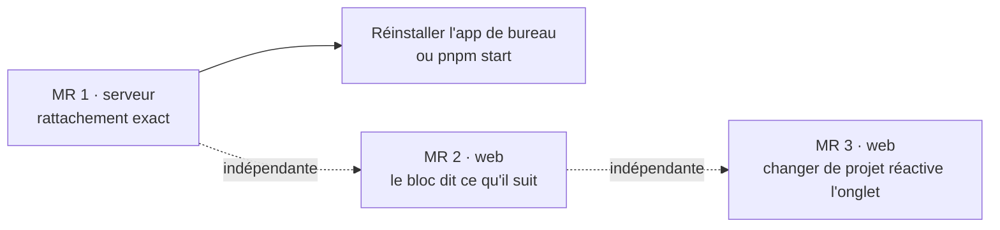

# Plan d'implémentation — le bloc suit vraiment l'onglet

Ordonnance le travail de la piste 10, dont les contrats sont dans
[`design-suivi-session.md`](design-suivi-session.md). Trois MR, chacune livrable
seule ; la première porte l'essentiel du risque, les deux autres sont courtes.

Règles de travail, inchangées : une fonctionnalité par commit ; commit seulement
quand `pnpm typecheck` et `pnpm test` sont verts ; vérification en direct dans
l'application avant la MR ; branche `aqn/<type>/<slug>`, PR en français, merge
avec suppression de branche. Le guide se met à jour dans la même MR que le code.

---

## Dépendances

Les trois MR ne se touchent pas : MR 1 vit dans `packages/server` et le panneau
Alertes, MR 2 et MR 3 dans `packages/web`. L'ordre 1, 2, 3 est celui du gain pour
l'utilisateur ; 2 et 3 peuvent s'inverser.

**Point d'attention** : l'application de bureau installée (`Local\Programs\Clide`)
embarque le serveur. MR 1 ne profite à l'utilisateur qu'après `pnpm package` et
réinstallation, ou en lançant `pnpm start`. MR 2 et MR 3 aussi, le bundle web étant
embarqué : c'est le même geste.

---

## MR 1 — Serveur : rattachement exact par les hooks

Branche `aqn/feat/hook-binding`. Taille : la plus grosse des trois.

### Tâches

| # | Quoi | Où | Test |
|---|---|---|---|
| 1.1 | `CLIDE_TERMINAL_ID=<id>` dans l'environnement du pty, posé dans `open` où l'id est déjà connu avant `spawn` ; fonction pure `terminalEnvironment(id, env)` qui englobe le nettoyage des `CLAUDE_CODE_*` | `server/src/pty/manager.ts` | `pty.test.ts` : la variable est là, les `CLAUDE_CODE_*` non |
| 1.2 | Enveloppe v2 dans `hookScript()` : `v`, `terminalId` lu dans `process.env.CLIDE_TERMINAL_ID` | `server/src/notifications/hook.ts` | `notifications.test.ts` : exécuter le script généré avec la variable posée, relire le fichier déposé |
| 1.3 | `SessionStart` dans `HOOK_DEFINITIONS`, kind `session` ; `NotificationKind` étendu | `hook.ts`, `watcher.ts` | statut « installés » exige les cinq types |
| 1.4 | `hooksStatus` : `outdated` (script déposé ≠ `hookScript()`), `legacy` (entrées reconnues par `LEGACY_HOOK_SCRIPTS`) ; `pruneLegacyHooks` ; `migrateHooks` généralisé à la liste | `hook.ts`, `core/src/paths.ts` (`roamingDir`) | ancien `hook.cmd` ClaudeTerm retiré, nos entrées posées, un hook étranger sur `Stop` conservé, mise en forme intacte |
| 1.5 | `parseNotification` lit `terminalId` et `source` ; une enveloppe v1 passe encore | `watcher.ts` | `notifications.test.ts` |
| 1.6 | `terminalOf` : onglet nommé, dossier en secours, onglet fermé ignoré ; les deux abonnés l'utilisent ; `session` n'est pas remonté comme alerte ; la migration des hooks tourne à chaque démarrage | `server/src/server.ts` | `server.test.ts` : `terminalOf` sur un gestionnaire factice |
| 1.7 | Onglets non rattachés parcourus par `since` décroissant | `server/src/sessions/live.ts` | `live.test.ts` : deux onglets, un transcript créé après le second, c'est le second qui l'a |
| 1.8 | Route `POST /api/notifications/prune-legacy` ; statut enrichi sur `GET /api/notifications` ; type `HooksStatus` côté web | `server/src/api/routes.ts`, `web/src/lib/types.ts` | — |
| 1.9 | Panneau Alertes : badge « à mettre à jour », bloc « anciennes installations » avec « Retirer » ; chaînes anglaises | `web/src/components/panels/global.tsx`, `web/src/i18n/en.ts` | vérification en direct |
| 1.10 | Guide : Alertes (cinq hooks, version du script, anciennes installations) dans `panneau-global.md` ; « La session d'un onglet » dans `session.md` (rattachement par l'onglet, secours par dossier) | `docs/guide/` | `pnpm docs:build` |

### Ordre interne

1.1 → 1.2 → 1.3 → 1.5 → 1.6 (le routage a besoin de l'enveloppe et du type) ;
1.4 et 1.7 en parallèle de tout le reste ; 1.8 → 1.9 → 1.10 pour finir.

### Vérification en direct

Sans toucher au `settings.json` réel : un projet de brouillon dans le scratchpad,
dont `.claude/settings.local.json` déclare les cinq hooks vers le script et le
dossier d'événements d'un serveur de test (`LOCALAPPDATA` isolé, `CLIDE_PORT`
fixe, `CLIDE_NO_OPEN=1`). Puis, dans la page :

1. Ouvrir un onglet Claude dans ce projet, accepter l'invite de confiance ; **avant
   tout prompt**, le bloc montre déjà la session (rattachement par `SessionStart`).
2. Taper `/clear` : le bloc passe sur la nouvelle session dès l'invite revenue.
   Noter au passage si `session_id` change — la documentation ne le dit pas.
3. Ouvrir deux onglets Claude dans le même projet sans rien taper, puis un prompt
   dans le second : c'est le second qui se rattache.
4. Un `claude -p "Réponds seulement : OK"` lancé hors de Clide dans ce dossier :
   l'événement arrive sans `terminalId` et ne vole aucun onglet.
5. Alertes avec les anciennes entrées dans un `settings.json` de test
   (`settingsPath` du serveur) : « anciennes installations » listées, « Retirer »
   les enlève et laisse le reste.

Nettoyage : tuer le serveur de test par son port, supprimer `.playwright-mcp/`,
supprimer le dossier `~/.claude/projects/<chemin du brouillon>`.

### Sortie

Commit `feat(hooks): bind a tab to its session through the hooks, take over stale
installs`. PR, merge. Puis, pour l'utilisateur : réinstaller l'application, ouvrir
Alertes, constater « installés » (les hooks ClaudeTerm ont été repointés au
démarrage).

---

## MR 2 — Web : le bloc dit ce qu'il suit

Branche `aqn/feat/session-follow`. Taille : petite.

| # | Quoi | Où |
|---|---|---|
| 2.1 | History : choisir la session vivante de l'onglet actif garde `followLive` ; une autre le coupe | `web/src/components/panels/global.tsx` |
| 2.2 | `detached = !followLive && current !== undefined` ; en-tête du bloc : titre puis puce « détaché · suivre l'onglet », clic → `followLive: true` | `web/src/components/TerminalArea.tsx` (l'en-tête est déjà un `ReactNode`) |
| 2.3 | Chaînes anglaises ; guide `session.md`, section « La session d'un onglet » | `en.ts`, `docs/guide/session.md` |

**Vérification en direct** : un onglet Claude vivant ; cliquer sa session dans
History → pas de puce, le bloc continue de bouger ; cliquer une autre session →
puce ; cliquer la puce → retour à l'onglet ; fermer l'onglet → la puce disparaît
(plus rien à suivre).

Commit `feat(session): keep following the tab from History, say when detached`.

---

## MR 3 — Web : changer de projet réactive son onglet

Branche `aqn/feat/project-tab`. Taille : petite.

| # | Quoi | Où |
|---|---|---|
| 3.1 | `lastTab: Record<string, string>` dans l'état, non persisté ; `activateProject(root)` | `web/src/state/store.ts` ou `terminals.ts` (là où vit `focusTerminal`) |
| 3.2 | `focusTerminal` note `lastTab[owner]` | `web/src/state/terminals.ts` |
| 3.3 | Appelants : pastille de la barre de titre, `nextProject`, `openProject` quand il active, `closeProject` quand il retombe sur un autre projet | `TitleBar.tsx`, `commands.ts`, `store.ts` |
| 3.4 | Guide `index.md` : le projet actif revient avec son dernier onglet | `docs/guide/index.md` |

**Vérification en direct** : deux projets de brouillon, deux onglets dans le
premier, un dans le second ; regarder le second onglet du premier projet, passer
au second projet par la pastille, revenir par `Alt+Page préc.` : c'est le second
onglet qui revient, le pied de zone et le bloc le décrivent ; un projet sans
onglet montre « Aucun terminal » et un pied vide.

Commit `feat(projects): switching project brings back its last tab`.

---

## Risques et parades

- **`session_id` après `/clear`** : non documenté. `bind` compare le chemin du
  transcript, pas l'identifiant ; les deux cas passent. À noter en 1.4 du test
  en direct.
- **`fs.watch` sous Windows** rate des créations : le balayage périodique du
  veilleur existe déjà, `SessionStart` en profite.
- **Un processus Node par `SessionStart`**, y compris à chaque compaction :
  hors du chemin de chaque outil, comme `UserPromptSubmit` ; acceptable.
- **`settings.json` illisible** au démarrage : la migration ne fait rien, `legacy`
  reste rempli, le panneau le montre. Rien n'est perdu.
- **L'application installée** ne change pas tant qu'on ne la réinstalle pas : le
  dire à la fin de MR 1, sinon l'utilisateur ne verra rien.
